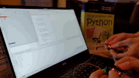
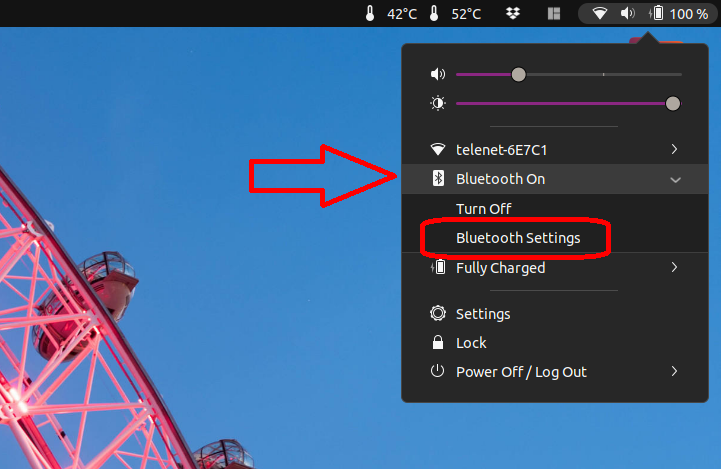
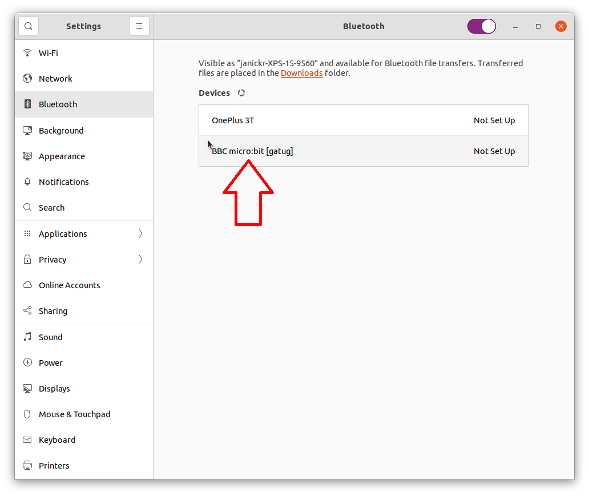
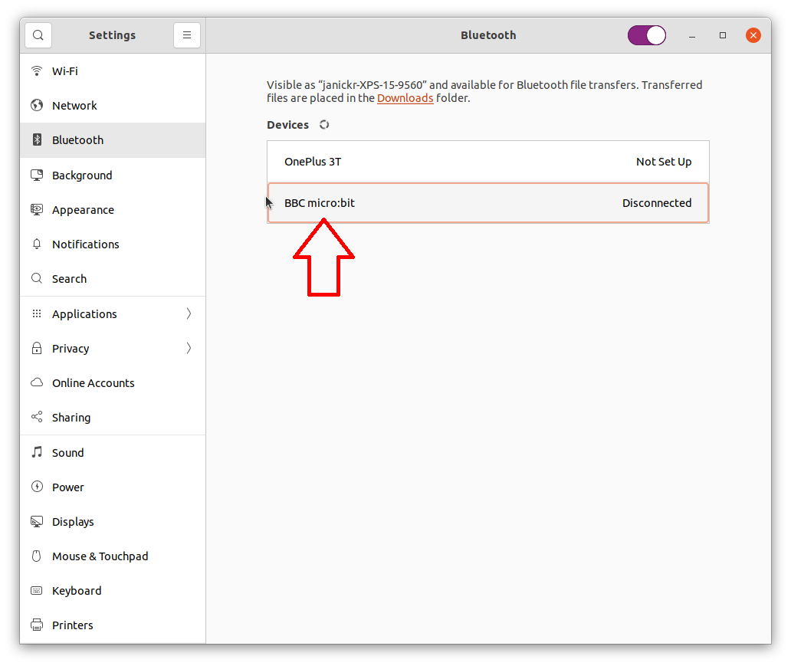
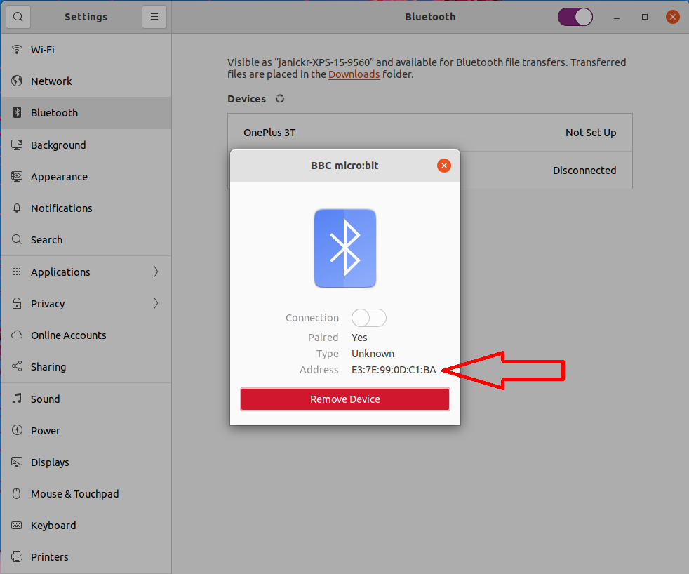

After following the general pairing instructions below, head over to the 
[Kasper's microbit overview page](../../../#) and start creating your first game!

  
## Step-by-step instructions

First you'll need to put your micro:bit in "pairing mode":

  - Hold down the A, B and reset buttons simultaneously.
  - Release the reset button but still hold the A and B buttons.
  - The LED screen will fill and you should then see the Bluetooth logo, followed by a pairing pattern.
  - Now you can release the A and B buttons

Your micro:bit is in pairing mode and is discoverable by linux

Click on the Bluetooth icon in your system status area.  
Click "Bluetooth setting"

  

The "Bluetooth settings" screen opens. Linux will scan for bluetooth devices, your micro:bit should show up in the list
Click on the micro:bit device in the list, linux will pair with the micro:bit

  

Good job! Your micro:bit is paired in linux!

## Finding the Bluetooth address 
If you're not using the [easier connection methods](../../../how-to-connect/), but instead you want to 
[connect to a micro:bit by address](../../../how-to-connect/#connect-to-a-microbit-by-address), these are
the instructions to look up the address in gnome.

When the micro:bit is paired, click again to get the details of the micro:bit

  

A details window pops up. ***Write down the Bluetooth address of your micro:bit.***

## Create your first game

[Kasper's microbit](../../../#) is a python package to make a connection to a BBC micro:bit by means of the Bluetooth LE GATT services
exposed by the micro:bit.

  