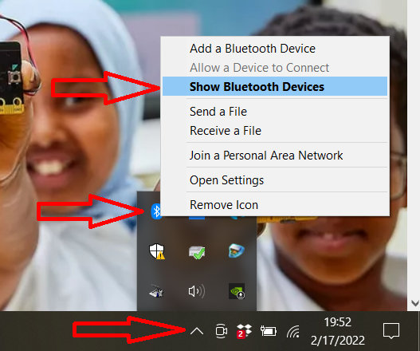
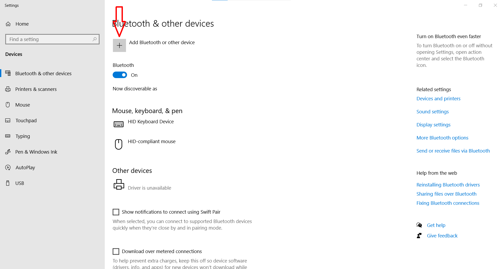
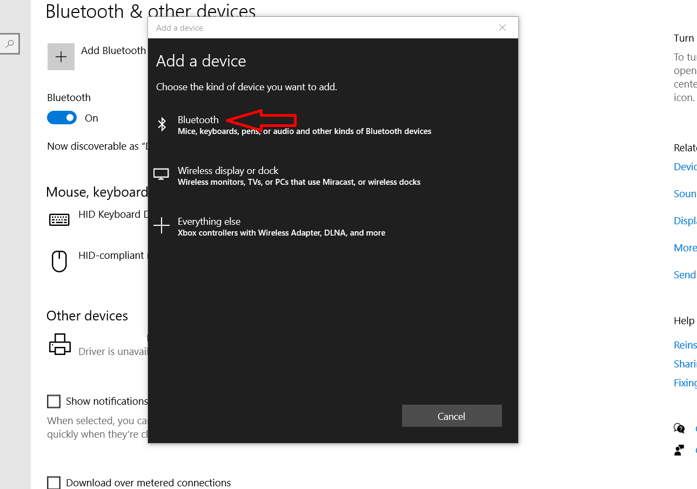
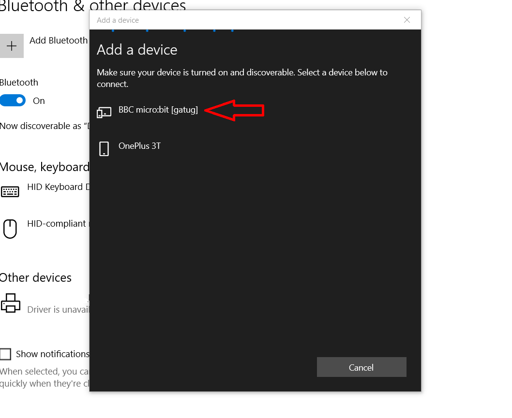
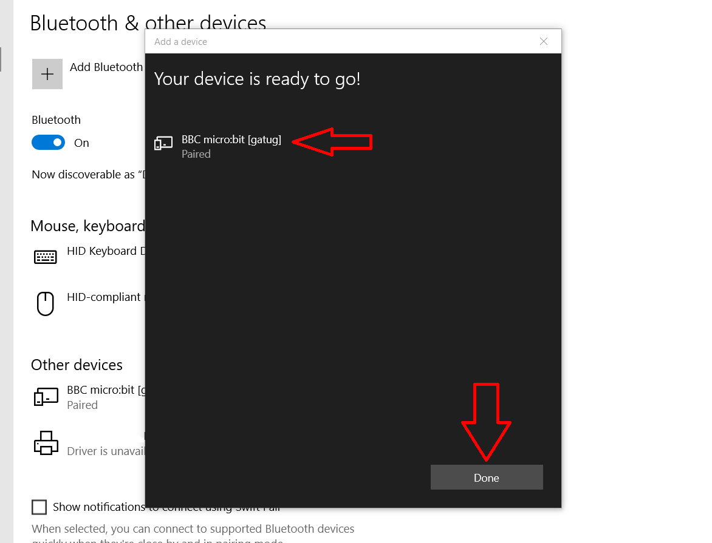
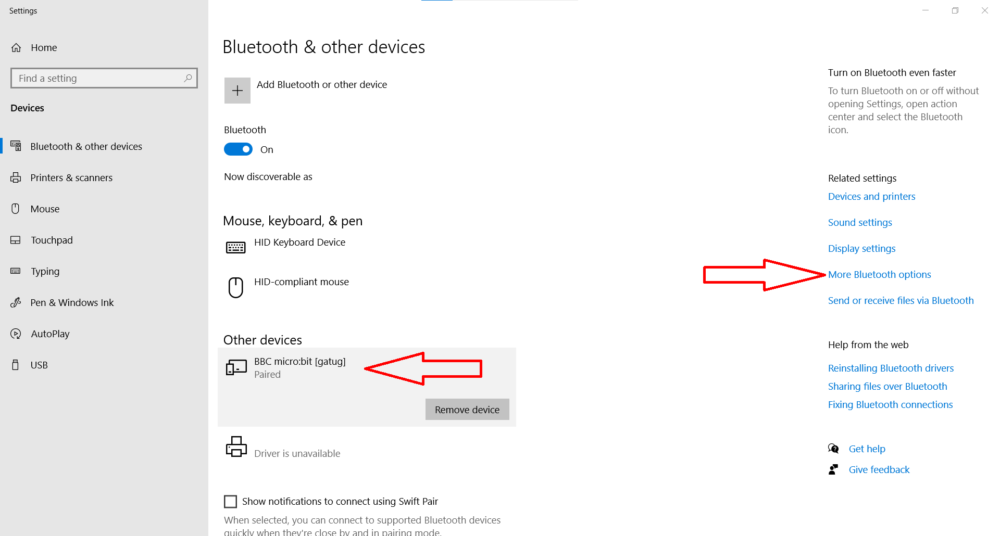
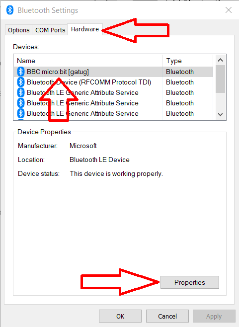
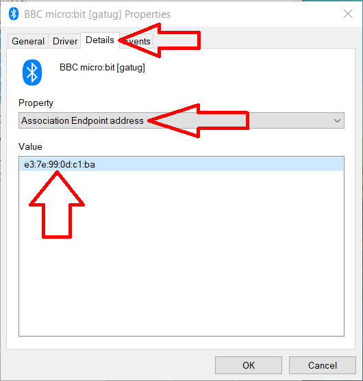

Click on the Bluetooth icon in your system tray.  
Click "Show Bluetooth devices"

  

The "Bluetooth & other devices" screen opens, click "Add Bluetooth or other device"

  

The "Add a device" screen pops up. Now you'll need to put your micro:bit in "pairing mode":

  - Hold down the A, B and reset buttons simultaneously.
  - Release the reset button but still hold the A and B buttons.
  - The LED screen will fill and you should then see the Bluetooth logo, followed by a pairing pattern.
  - Now you can release the A and B buttons

Your micro:bit is in pairing mode and is discoverable by Windows
Now click on "Bluetooth"

  

Windows will scan for bluetooth devices, your micro:bit should show up in the list

Click on the micro:bit device in the list, Windows will pair with the micro:bit

You can click "Done" your micro:bit is paired with windows
Now we need the address of the micro:bit. Back on the Bluetooth & other devices screen, select your micro:bit and click
"More Bluetooth options"

The Bluetooth settings window pops up. On the "Hardware" tab, select your micro:bit and click "Properties"  

The micro:bit properties window pops up. On the "Details" tab, select the "Association Endpoint address" property. 
The value of this property is the bluetooth address of your micro:bit.  ***Write this address down somewhere*** you'll
need it to connect to your micro:bit.

