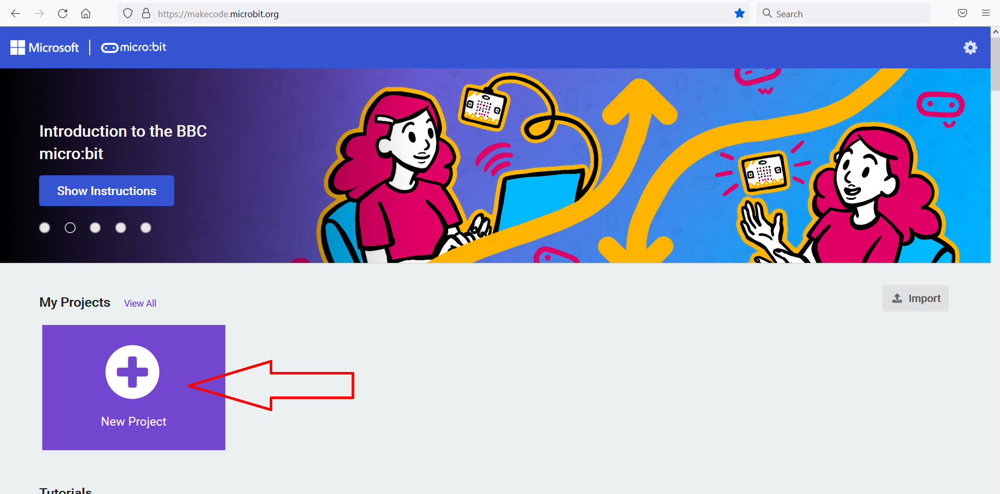
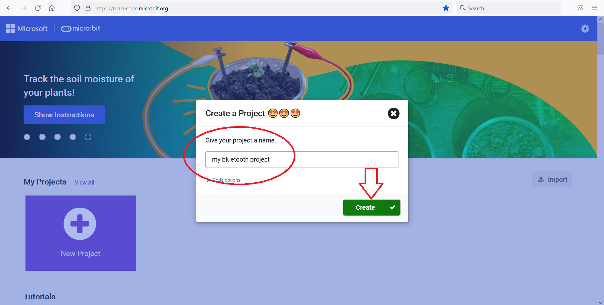
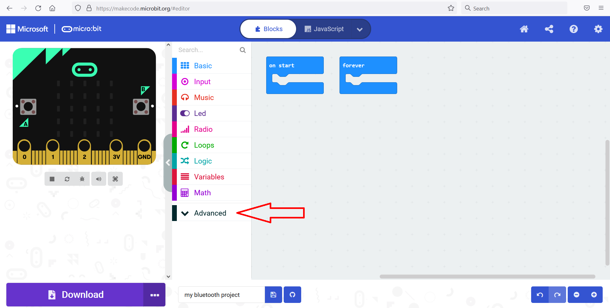
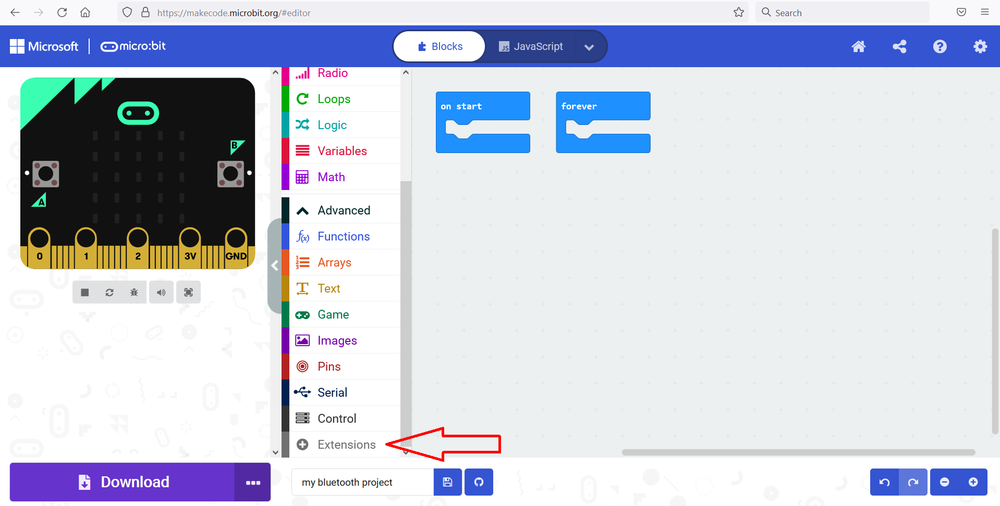
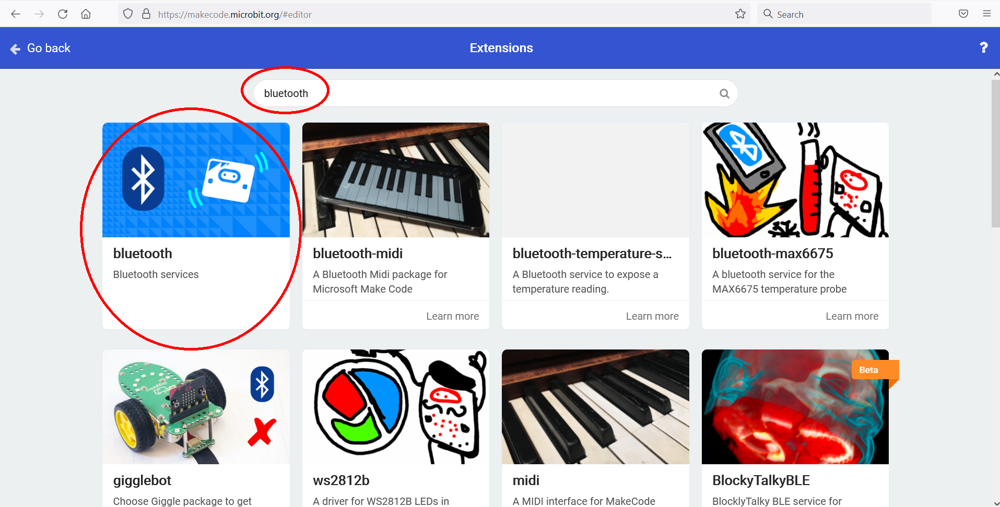
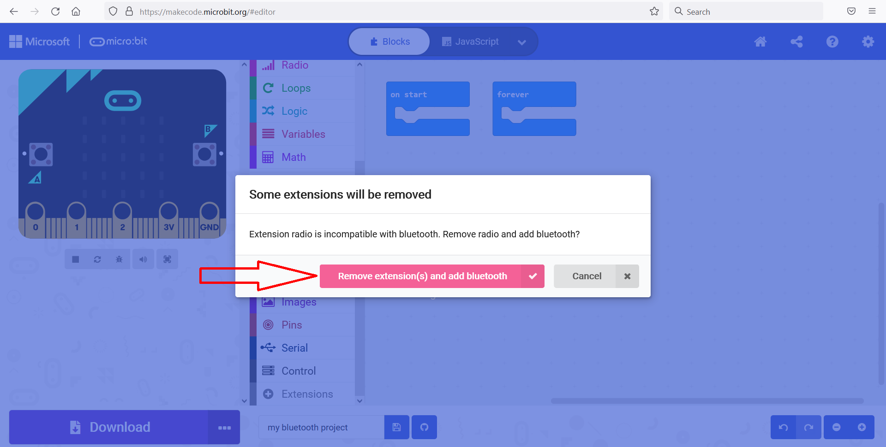
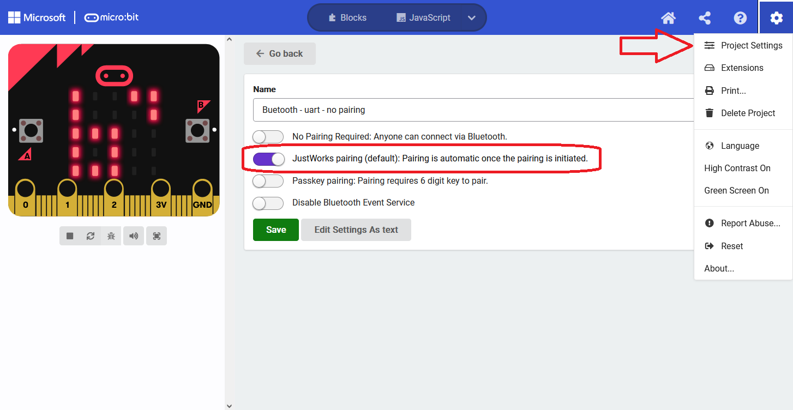
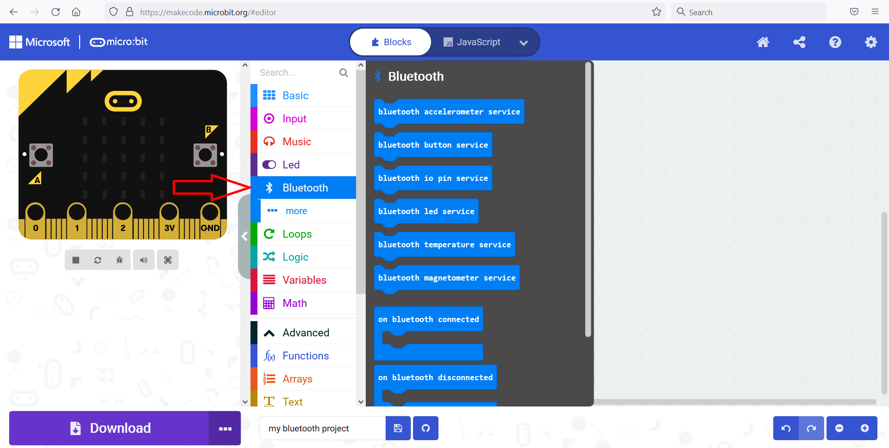

# Your own MakeCode project (With pairing needed)

You can create a Bluetooth-enabled [MakeCode](https://makecode.microbit.org) project yourself. 
Below are the detailed instructions to create a micro:bit MakeCode project, enable the Bluetooth extension 
and enable JustWorks pairing. A project with [pairing enabled](#enable-pairing) makes sure that only those 
devices/computers that are paired to it can connect to it.

However, it also has a few disadvantages

- it does not work [for a micro:bit v1.x on windows](../index.md#microbit-versions-operating-systems-bluetooth-pairing)
- it requires the extra steps of pairing the micro:bit with your [operating](../bluetooth-pairing/windows/pairing-microbit-windows.md) [system](../bluetooth-pairing/linux/pairing-microbit-linux-gnome.md)
- A paired micro:bit does not advertise its name, so you cannot find it by name 

## Create a project
In MakeCode for micro:bit, select "New Project"  

  
  
Enter a name:

  

## Add the Bluetooth extension
You'll need to add the Bluetooth extension.   
Select "Advanced"

  

Select "Extensions"  

  

Search for Bluetooth, and select the Bluetooth extension

  

A popup appears, informing you that the "radio" extension will be removed if you add Bluetooth. 
Select "Remove extension and add Bluetooth", this will only apply to this project.  

  

## Enable pairing

In the top-right corner click on the cog icon and select project settings. Enable the "JustWorks pairing (default): 
Pairing is automatic once the pairing is initiated" option. Save the Settings.

## Add Bluetooth services

Now you can select blocks from the bluetooth tab:  

  

Drag the services you want to enable in an "On start" block  

  

The micro:bit v1 has too little memory to enable all bluetooth services. If you try to enable them all, after 
copying the hex the micro:bit, the LED display wil show a sad face and then scroll 020, this means the micro:bit is out of memory.
See also: [the micro:bit error codes](https://makecode.microbit.org/device/error-codes)

## Download the hex file
Download the hex file and copy it to your micro:bit!  

