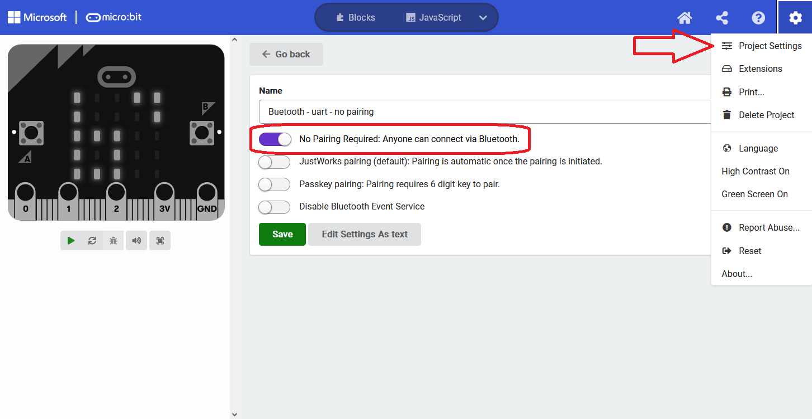

# Your own MakeCode project (No pairing required)

You can create a Bluetooth-enabled [MakeCode](https://makecode.microbit.org) project yourself. 
Below are the detailed instructions to create a micro:bit MakeCode project, enable the Bluetooth extension 
and disable pairing. A project with [pairing disabled ("No pairing required")](#disable-pairing) is the easiest to work with:

- it works on the [widest range of micro:bit versions and operating systems](../../#microbit-versions-operating-systems-bluetooth-pairing)
- it doesn't require the extra steps of pairing the micro:bit with your operating system
- it makes the microbit advertise its name, so you can [find it by name](../../reference/kaspersmicrobit/#kaspersmicrobit.kaspersmicrobit.KaspersMicrobit.find_one_microbit)

The disadvantage is that anyone can connect with the micro:bit over Bluetooth, because it is not needed to be paired to it.

## Create a project
In MakeCode for micro:bit, select "New Project"  

  
  
Enter a name:

  

## Add the Bluetooth extension
You'll need to add the Bluetooth extension.   
Select "Advanced"

  

Select "Extensions"  

  

Search for Bluetooth, and select the Bluetooth extension

  

A popup appears, informing you that the "radio" extension will be removed if you add Bluetooth. 
Select "Remove extension and add Bluetooth", this will only apply to this project.  

## Disable pairing

## Add Bluetooth services
The micro:bit v1 has too little memory to enable all bluetooth services. If you try to enable them all, after 
copying the hex the micro:bit, the LED display wil show a sad face and then scroll 020, this means the micro:bit is out of memory.
See also: [the micro:bit error codes](https://makecode.microbit.org/device/error-codes)

  

No you can select blocks from the bluetooth tab:  

  

Drag the services you want to enable in an "On start" block  

## Download the hex file
Download the hex file and copy it to your micro:bit!  

