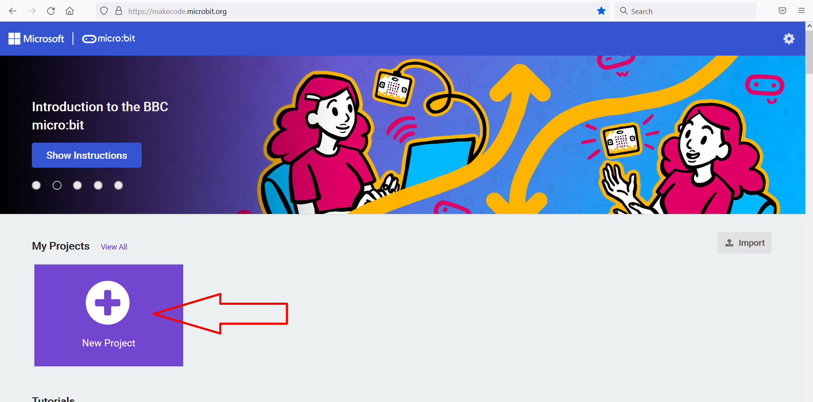
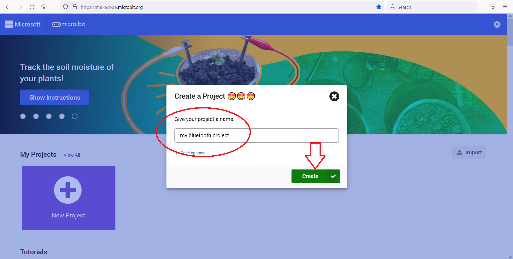
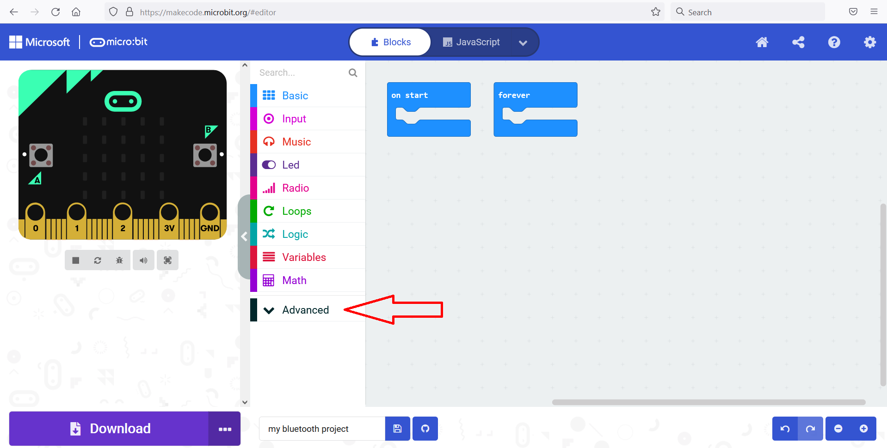
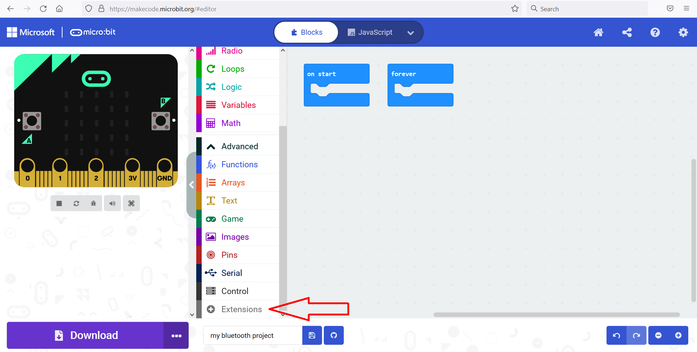
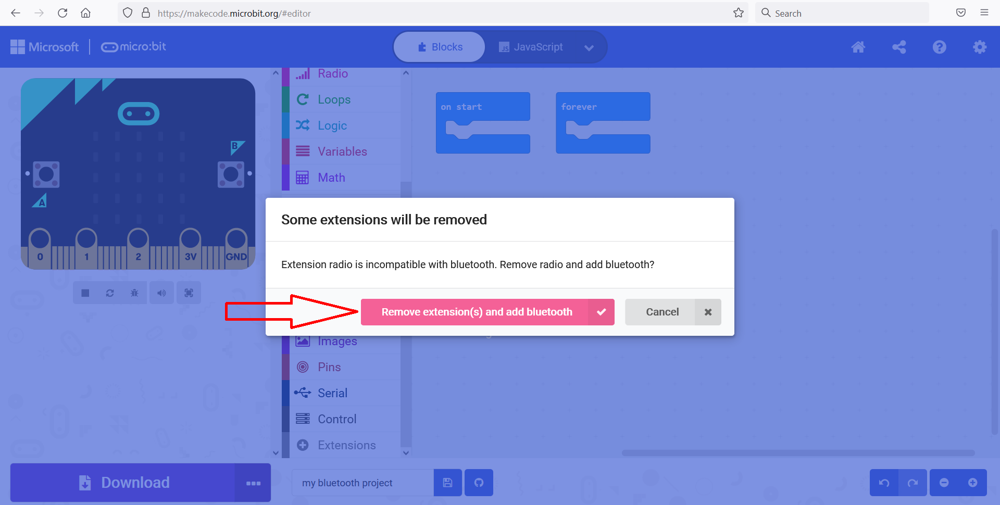
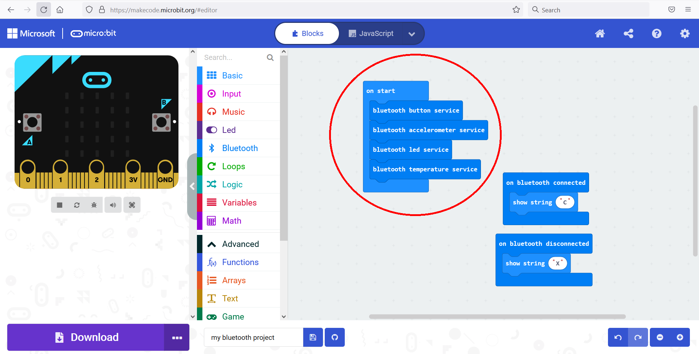

## Option 1: Download a .hex file

### The micro:bit v2
To enable the Bluetooth services copy
[this hex file](../../hex/microbit-v2-bluetooth-all-services-active.hex)
file to your micro:bit. The hex file was created using [this makecode project](https://makecode.microbit.org/_cdLL0DH1Hc02).
It will enable following services:

  - [accelerometer](../accelerometer.md)
  - [buttons](../buttons.md)
  - [led](../led.md)
  - [temperature](../temperature.md)
  - [io-pin](../io_pin.md)
  - [magnetometer](../magnetometer.md)
  - [uart](../uart.md)

Enabled by default

  - [event service](../events_v2.md)
  
### The micro:bit v1
The micro:bit v1 has too little memory to enable all bluetooth services. If you try to enable them all, after 
copying the hex the micro:bit, the LED display wil show a sad face and then scroll 020, this means the micro:bit is out of memory.
See also: the micro:bit [error codes](https://makecode.microbit.org/device/error-codes)

Below you can find links to hex files with a subset of services enabled. Of course, you could also create a hex file
with a different subset of services by using [MakeCode](#option-2-use-makecode-yourself)

#### All services except magnetometer and uart
To enable these services copy
[this hex file](../../hex/microbit-v1-bluetooth-without-magnetometer-or-uart.hex)
file to your micro:bit. The hex file was created using [this makecode project](https://makecode.microbit.org/_c5RJFdEqkdAs).
It will enable following services:

  - [accelerometer](../accelerometer.md)
  - [buttons](../buttons.md)
  - [led](../led.md)
  - [temperature](../temperature.md)
  - [io-pin](../io_pin.md)

Enabled by default

  - [event service](../events_v1.md)

#### Only magnetometer + uart
To enable the Bluetooth [magnetometer](../magnetometer.md) and [uart](../uart.md) services copy
[this hex file](../../hex/microbit-v1-bluetooth-magnetometer-uart.hex)
file to your micro:bit. The hex file was created using [this makecode project](https://makecode.microbit.org/_YHz6WqMqKA7E).
The [event service](../events_v1.md) will be enabled by default

## Option 2: Use MakeCode yourself
You could also create the [MakeCode](https://makecode.microbit.org) project yourself:  

### Create project
In MakeCode for micro:bit, select "New Project"  

  
  
Enter a name:

  

### Add the Bluetooth extension
You'll need to add the Bluetooth extension.   
Select "Advanced"

  

Select "Extensions"  

  

Search for Bluetooth, and select the Bluetooth extension

  

A popup appears, informing you that the "radio" extension will be removed if you add Bluetooth. 
Select "Remove extension and add Bluetooth", this will only apply to this project.  

### Add bluetooth services
  

No you can select blocks from the bluetooth tab:  

  

Drag the services you want to enable in an "On start" block  

  

Download the hex file and copy it to your micro:bit!  

