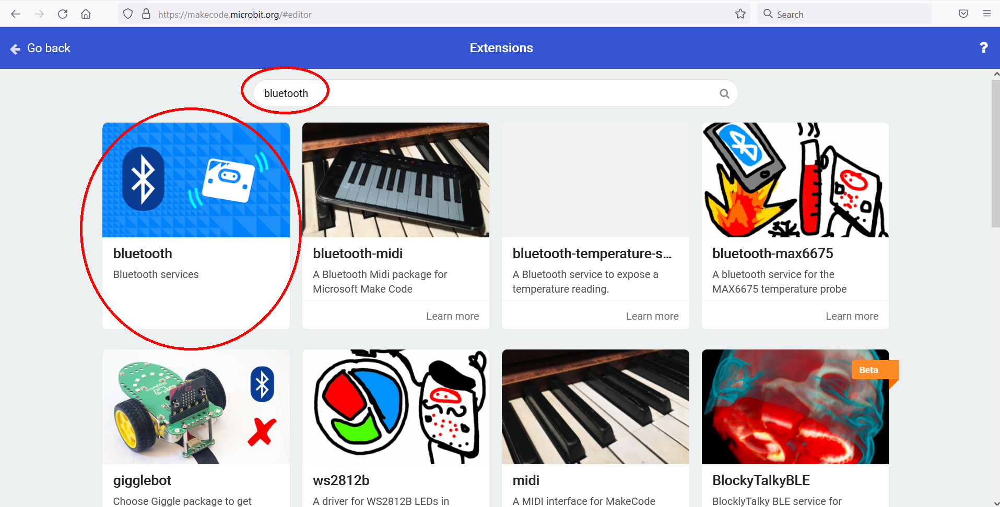

## Option 1: Download a .hex file
To enable the Bluetooth services copy
[this hex file](https://github.com/janickr/kaspersmicrobit/blob/main/hex/microbit-bluetooth-all-services-active.hex) file to your microbit. The hex file was created using 
[this makecode project](https://makecode.microbit.org/_cdLL0DH1Hc02).
It will enable following services:

  - [accelerometer](../accelerometer.md)
  - [buttons](../buttons.md)
  - [led](../led.md)
  - [temperature](../temperature.md)
  - [io-pin](../io_pin.md)
  - [magnetometer](../magnetometer.md)
  - [uart](../uart.md)

## Option 2: Use MakeCode yourself
You could also create the [MakeCode](https://makecode.microbit.org) project yourself:  

### Create project
In MakeCode for microbit, select "New Project"  

  
  
Enter a name:

  

### Add the Bluetooth extension
You'll need to add the Bluetooth extension.   
Select "Advanced"

  

Select "Extensions"  

  

Search for Bluetooth, and select the Bluetooth extension

  

A popup appears, informing you that the "radio" extension will be removed if you add Bluetooth. 
Select "Remove extension and add Bluetooth", this will only apply to this project.  

### Add bluetooth services
  

No you can select blocks from the bluetooth tab:  

  

Drag the services you want to enable in an "On start" block  

  

Download the hex file and copy it to your microbit!  

